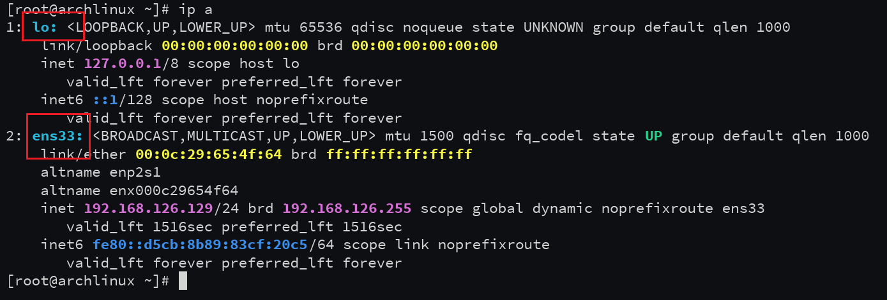

# 成都锦城学院电信校园网断网自动登录脚本（适用于openwrt系统）

## 准备条件

需要一个校园网账号和密码（自备）

## 账号密码配置（修改宏）

修改账号密码配置信息文件：

```cpp
#ifndef USER_ACCOUNT
#define USER_ACCOUNT    ",0,username"      // your full account string
#endif
#ifndef USER_PASSWORD
#define USER_PASSWORD   "password"         // password
#endif
#ifndef AC_IP
#define AC_IP           "AC_IP"   // AC server IP
#endif
#ifndef AC_NAME
#define AC_NAME         "ac_name"  // AC name (URL-encoded internally)
#endif
#ifndef AUTH_HOST_IP
#define AUTH_HOST_IP    "110.188.66.35"    // Auth server IP (must be IP to avoid DNS)
#endif
#ifndef AUTH_PORT
#define AUTH_PORT       801
#endif
#ifndef AUTH_PATH
#define AUTH_PATH       "/eportal/"
#endif
#ifndef CHECK_TARGETS
// Multiple online check targets (IPs and paths), tried in order
#define CHECK_TARGETS \
    {"223.5.5.5", "/", 80}, \
    {"119.29.29.29", "/", 80}, \
    {"www.baidu.com", "/", 80}   // Keep one domain as fallback (will resolve using cache)
#endif
#ifndef WAN_IFACE
#define WAN_IFACE       "eth1"
#endif
```

- `username`：账号
- `password`：密码
- `AC_IP`：离你最近的 AC 的 IP（网页登录时用开发者工具抓取）
- `ac_name`：同上（从登录请求中提取）
- `WAN_IFACE`：你的设备 WAN 接口名（用 `ip a` / `ip addr` 查看）

### 如何获取这些参数

电脑连接校园网，打开浏览器 **F12 → Network**
勾选 **Preserve log**
登录校园网门户
找到 URL 包含 `eportal/?c=Portal&a=login` 的请求
右键 → Copy → Copy as cURL（bash）
从 URL 中提取参数：

| **URL参数** | **对应宏** |
| --- | --- |
| `user_account=...`（URL解码后） | `USER_ACCOUNT` |
| `user_password=...` | `USER_PASSWORD` |
| 主机名（`http://xxx.xxx.xxx.xxx`） | `AUTH_HOST` |
| `wlan_ac_ip=...` | `AC_IP` |
| `wlan_ac_name=...`（URL解码后） | `AC_NAME` |

### 如何确认 WAN 接口名

SSH 到路由器执行：

```bash
ifconfig
# 或
ip addr
```

找有公网 IP（非 192.168.x.x、非 10.x.x.x、非 172.16-31.x.x）的接口名。

| **设备** | **常见 WAN 接口** |
| --- | --- |
| RK3528 盒子 | `eth0` 或 `eth1` |
| Redmi 3G | `eth0.2` |
| PPPoE 拨号 | `pppoe-wan` |
| 软路由 | `eth0` 或 `eth1` |



## 源码文件

完整代码见文件 **`schoolnet-daemon.cpp`**，保存名为 **`schoolnet-daemon.cpp`**。

## 编译环境（Linux）

准备一个 Linux 系统（任意发行版均可），安装好编译工具：

```bash
sudo apt-get update
sudo apt-get install -y \
	build-essential \
	libncurses5-dev \
	libncursesw5-dev \
	zlib1g-dev \
	gawk \
	git \
	gettext \
	libssl-dev \
	xsltproc \
	zip \
	python3 \
	python3-distutils \
	wget \
	unzip \
	rsync \
	file \
	ca-certificates
```

## 下载 SDK（以 RK3528 / aarch64 为例）

下载 SDK：根据不同的架构下载不同的 SDK，这里使用 **RK3528 / aarch64 架构**。

如何查看请使用 `uname -m` ，**（注意：请提前准备好魔法环境，因为下载和编译可能会需要）**


```bash
wget https://downloads.openwrt.org/releases/23.05.3/targets/armsr/armv8/openwrt-sdk-23.05.3-armsr-armv8_gcc-12.3.0_musl.Linux-x86_64.tar.xz
```

解压下载的文件：

```bash
tar -xJf openwrt-sdk-23.05.3-armsr-armv8_gcc-12.3.0_musl.Linux-x86_64.tar.xz
```

设置环境变量：

```bash
export STAGING_DIR=$HOME/openwrt-sdk-23.05.3-armsr-armv8_gcc-12.3.0_musl.Linux-x86_64/staging_dir
export PATH=$STAGING_DIR/toolchain-aarch64_generic_gcc-12.3.0_musl/bin:$PATH
```

编译：

```bash
aarch64-openwrt-linux-musl-g++ -std=c++17 -O3 -flto \
	-mcpu=cortex-a53 -mtune=cortex-a53 \
	-funroll-loops -fomit-frame-pointer \
	-ffunction-sections -fdata-sections -Wall \
	-o schoolnet-daemon schoolnet-daemon.cpp \
	-Wl,--gc-sections -Wl,--as-needed
```

## 运行与裁剪

运行：编译成功后会得到 `schoolnet-daemon` 二进制文件，下载到设备上。


裁剪：

```bash
aarch64-openwrt-linux-musl-strip schoolnet-daemon
```

验证：

```bash
file schoolnet-daemon
```

输出: ELF 64-bit LSB executable, ARM aarch64, ..., stripped

## OpenWrt 服务管理（init.d）

新建文件 **`/etc/init.d/schoolnet-daemon`** 对脚本进行管理，内容如下。将 `schoolnet-daemon` 文件放在 `/usr/bin/schoolnet-daemon` 目录（目录位置可根据需要更改）下并添加执行权限。

```bash
#!/bin/sh /etc/rc.common

START=99
STOP=10

USE_PROCD=1
NAME=schoolnet-daemon
PROG=/usr/bin/schoolnet-daemon
LOGGER_LEVEL=info     # adjust as needed: debug, info, err

start_service() {
    # Ensure the binary exists
    if [ ! -x "$PROG" ]; then
        echo "$PROG not found or not executable" >&2
        return 1
    fi

    # Create a dedicated log directory (if you want file logging)
    mkdir -p /var/log

    procd_open_instance
    procd_set_param command "$PROG"

    # Respawn with a sensible limit to prevent infinite fast restart loops
    procd_set_param respawn 3600 5 10   # respawn if died within 3600s, delay 5s, max 10 retries

    # Redirect stdout/stderr to logread (via procd's logging)
    # This allows `logread -e schoolnet-daemon` to capture all output.
    procd_set_param stdout 1
    procd_set_param stderr 1

    # Optional: set a nice value to reduce CPU competition
    # procd_set_param limits nice="-5"

    # Optional: set environment variables if needed
    # procd_set_param env HOME="/tmp" PATH="/usr/sbin:/usr/bin:/sbin:/bin"

    procd_close_instance
}

service_triggers() {
    # Make the service restart when the WAN interface comes up or changes
    # This ensures the daemon reacts to netlink events AND is restarted
    # if it was down when WAN appeared.
    procd_add_interface_trigger "interface.*" "wan" /etc/init.d/schoolnet-daemon restart
}
```

## 自启与启动

设置开机自启并启动：

```bash
/etc/init.d/schoolnet-daemon enable
/etc/init.d/schoolnet-daemon start
```

## 管理命令

管理命令：

```bash
# 启动
/etc/init.d/schoolnet-daemon start

# 停止
/etc/init.d/schoolnet-daemon stop

# 重启
/etc/init.d/schoolnet-daemon restart

# 查看状态
/etc/init.d/schoolnet-daemon status

# 禁用开机启动
/etc/init.d/schoolnet-daemon disable

# 前台调试运行（直接看输出）
/usr/bin/schoolnet-daemon
```

## 日志

查看日志文件：

```bash
/var/log/schoolnet-daemon.log
```

## 指定日志文件位置（可选）

指定日志文件位置（可选）：

```cpp
这是由 DaemonCore::init() 中的这行代码指定的：
if (!g_log.init("/var/log/schoolnet-daemon.log")) {……}
```

## 效果

至此校园网断网自动检测重连的功能已实现，能够实现毫米级的断网自动重连。

- 纯 C++ 标准库 + socket：编译出的二进制直接运行
- 状态机去阻塞：完全消除 sleep，所有延迟通过 timerfd 实现
- DNS 不再阻塞：检测和认证全部使用编译期固定 IP
- 多目标在线检测：依次尝试多个稳定 IP（阿里 DNS、百度等），任一可达即视为在线，避免单点误判
- 网络 API 加固：非阻塞 connect 的 select 加入 EINTR 重试；超时精确控制
- 成功判断更严格：精确匹配学校返回的 "result":"1" 或 "success":"1" 等明确字段
- Netlink 实时监听：WAN 口地址变化或链路状态变化（RTM_NEWADDR、RTM_DELADDR、RTM_NEWLINK）立即触发状态机切换为 Checking，并立即执行检查/登录
- 断线后的快速重试：离线后采用指数退避但起点极低（50ms），配合 LoginWait 状态使用定时器非阻塞等待
- 正常在线时低频检查：每隔 CHECK_INTERVAL_MS（推荐 10 秒）一次，大幅降低 CPU 占用
- 结果：平时 CPU 占用近乎 0%，断网后 1 秒内开始重连流程

==麻烦学弟学妹们帮我点点⭐️🤩star🤩⭐️，感谢！！！💋💋💋==
